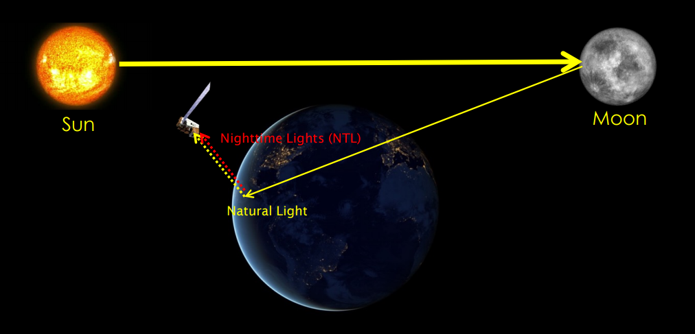
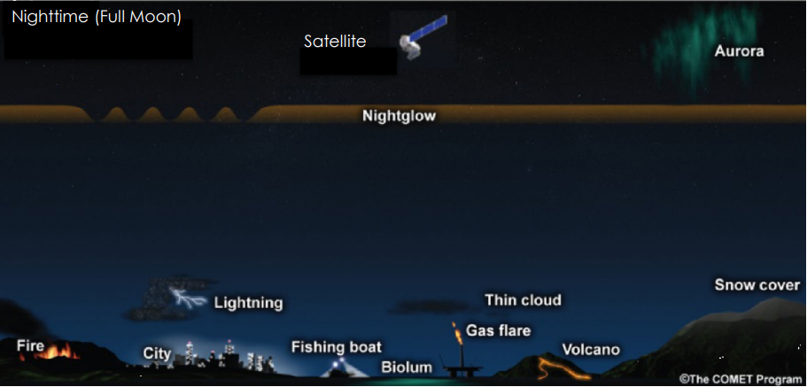
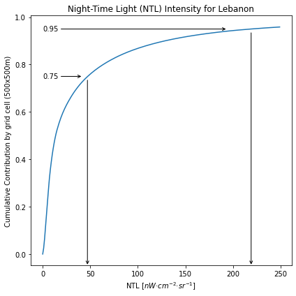
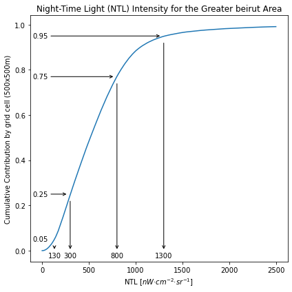

ref: https://www.markdownguide.org/basic-syntax/

note: reorder the locations, from blast site (1) to Airport (6) - ports first, residential second.

  
<h1 align=center> Night-Time Light as an Indicator</h1> 
 
<h2 align=center> Exploring the Night-Time Light Intensities before and after the Beirut 2020 Explosion</h2>

--- 

Gijs van den Dool [a](#f1)
@ Space-ins.-Solutions [b](#f1)

--- 

 
<h2> Motivation </h2>

Night-Time Light satellite products often mentioned as an input parameter for sociological studies, for example, in this study from the Universities of Wageningen, Utrecht and Nanjing: “Detecting Inequality from Space.” (2021)  [ [1](#f1)  ] , or “Spatially explicit global gross domestic product (GDP) data set consistent with the Shared Socioeconomic Pathways” by Wang and Sun (2021)  [ [2](#f1)  ] , to give two examples out of many scientific publications, and from personal experience, I participated in two projects with Omdena, WRI, ACET and DSSG in which we used NTL to compute an index for either well-being or access to electricity  [ [3](#f1), [4](#f1)  ] .

My first encounter with NTL was, however, in a NASA-ARSET training: Introduction to NASA’s “Black Marble” Night Lights Data   [ [5](#f1)  ] , and while going through the training exercise to Monitoring the Disaster Impacts in Puerto Rico – After the Jan-2020 6.4 Earthquakes, I thought that looking at the Beirut explosion, and exploring the possibility to detect the effect of the blast (at ground zero) and the potential recovery, would be a good self-test for after the training.

This article will follow the steps in the training exercise, and most of the data handling scripts are modified from the training material to fit this case study; the notebooks I used for the analysis are part of a GitHub repository, and I placed a link in the reference section[c](#f1). I tried to follow a traditional research approach, by going through the different steps in the process, from data gathering to giving recommendations:
1. Data acquisition: the linked ARSET training material has an excellent tutorial on getting the data; I will briefly describe the data, and the features, and refer to this tutorial for the practical steps.

2. Data transformation: again using the scripts from the ARSET training material, but now used to convert the native format of the data to GeoTiff, other file formats are possible too (like xarray), but GeoTiff raster files were easy to implement and flexible enough.
3. Exploratory Data Analysis (EDA): The purpose of the analysis is to see if it is possible to detect the explosion in the NTL data, therefor six locations are selected, and in this section, the differences between the locations are explored to determine if it is possible to detect a trend in NTL, not only at the Blast Site but also in the surrounding areas.
4. Statistical Analysis: EDA is a general term to visualise the data by summary statistics and graphical representations, and to look at data before making any assumptions, as well as to discover patterns, spot anomalies, and test hypothesis.
5. In the concluding section, I will highlight my observations and  provide an outlook on the possible next steps.

Working through the exercises, applying them to a real-world problem, and seeing how the data changed during the EDA process, and the Statistical Analysis, was a nice experience. I am happy to share the NoteBook(s), and related material, and I hope that the code and this text can help you in your projects, and that it will give you some ideas on how to use NTL data; I am looking forward to the reactions and feedback in the comments. 
  

---

<h2> Background </h2>

 The project domain is defined by the night-time light (NTL) data extent (the grey areay in Figure 1, from 30 to 40 degree logitude and 30 to 40 degree latitude). Lebanon falls perfectly within one tile, so there is no need to merge multiple NTL tiles. Beiruit is the capital of Lebanon, and is situated at the coast, roughtly in the middle of the country (lower left image in Figure 1.). The blast site is in the northen part of the sity, in the harbor. The left image (Figure 1) shows the location of the six test sites in this study.

 

  
Figure 1: Area of Intrest (Lebanon/Beirut) 
 

<h3> Site selection </h3>

Six locations are selected to test the change in NTL before and afer the explosion (Figure 2). The location positions are randon, but the location type is prediterment. To compare the Blast Area (as a port location), two other port locations are selected, and the main intest of the study is to see if it is possible to detect recovery rates, so two residential areas are added to the selection, and finally the Airport is included in the test locations because of the presumed stability in NTL intensity.

 

  
Figure 2: Six pilot locations (Greater Beirut Area) 
  

---

<h2>Data</h2>

The primary data source for this project is the NASA Dark Marble dataset, or more scientifically: VNP46A2 Gap_Filled_DNB_BRDF-Corrected_NTL   [ [5b](#f1)  ] 
The central hypothesis of this study is that the explosion has disrupted the daily routine in the area; according to a UN report   [ [6](#f1)  ] , the blast caused material damage to an estimated 77,000 apartments
located across 10,000 buildings within a 3km radius (6 model cells) of the explosion, impacting around 300,000 people   [ [7](#f1)  ] . The assumption is that this disruption should be visible in the Night-Time Light (NTL) intensities. NTL is designed to pick up (under clear conditions) the street lights, illuminated buildings, and other human activity(Figure 2b). With most activity stopped, especially directly after the explosion, the post-explosion illumination values should be lower than the pre-explosion values. 

<h3>Night-Time Light </h3>

The VNP46A2 is selected as the only data product, in this study, because the data is cleaned and made analysis-ready. There are other NTL data sources, for example, the Colorado School of Mines data product   [ [8](#f1)  ] , but this data source was at the time of the data collection not available as a daily product. The VIIRS sensor collects imagery as it orbits the Earth every 100 minutes. Passing over the poles 14 times per day, it crosses the equator at 1:30am local time, photographing the entire world each day, with an image resolution of 500 m; these characteristics make this product a perfect dataset for daily observations and monitoring.

<table>
    <tr>
        <td>Principle of Night-Time Light Collection</td>
        <td>Light Sources</td>
    </tr>
    <tr>
        <td valign="top"></td>
        <td valign="top"></td>
    </tr>
    <tr>
        <td valign="top"> There are multiple light sources.  
        Observations include moonlight, light directly emitted by a source (e.g., buildings and transport), and light scattered by the ground.  
        Land features (such as buildings and trees) can also block the light source during different time periods. 
        </td> 
        <td valign="top"> Without moonlight: 
        • Artificial lights like street and building lighting   • Fishing boats   • Gas flares   • Fires   • Aurora   • Bioluminescence  • Nightglow from the atmosphere
        </td>
    </tr>
    <tr>
    <td colspan="2"> Source: NASA-ARSET Traning Material [5] </td>
    </tr>
    <tr>
    <td colspan="2" style='text-align:center; vertical-align:middle'> Figure 2b: Night Time Light data aquisition </td>
    </tr>
    
</table>

 
 

<h3>Night-Time Light in Lebanon and the Greater Beirut Area</h3>

 

<table>
    <tr>
        <td valign="top"></td>
        <td valign="top"></td>
    </tr>
    <tr>
    <td colspan="2" style='text-align:center; vertical-align:middle'> Figure 2c: Cummalative contribution of NTL intensities in Lebanon and the Greater Beirut Area   </td>
    </tr>
    
</table>

<h2>Exploratory Data Analysis (EDA)</h2>

 

<h3> EDA 1 </h3>

 

  
Figure 3: XXXX 
 

<h3> EDA 2 </h3>

 

  
Figure 4: XXXX 
 

<h3> EDA 3 </h3>

 

  
Figure 5: XXXX 
 

<h3> EDA 4 </h3>

 

  
Figure 6: XXXX 
 

<h3> EDA 5 </h3>

 

  
Figure 7: XXXX 
 

<h2>Statistics</h2>

 

<h3> Method 1: T-Test </h3>

 

<h3> Method 2: Causual Impact  </h3>

 

Table 1: Causal Imapact Results; method adapted from CausalImpact (xxxx, 2021) [5](#f1)   
<table>
    <tr>
        <td>Event date: 2020-08-04</td>
        <td>Event date: 2020-06-20</td>
    </tr>
    <tr>
        <td valign="top"></td>
        <td valign="top"></td>
    </tr>
    <tr>
        <td valign="top"> The probability of obtaining this effect by chance is p = 21.78%.   
        This means that, although the intervention appears to have caused a <strong>positive</strong> effect, the effect may be spurious and would generally not be considered statistically significant, when considering the entire post-intervention period as a whole. 
        </td> 
        <td valign="top"> The probability of obtaining this effect by chance is p = 9.59%.    
        Although it may look as though the intervention has exerted a <strong>negative</strong> effect on the response variable when considering the intervention period as a whole, this effect may be spurious and would generally not be considered statistically significant.
        </td>
    </tr>
    
</table>
 
 

<h2>Conclusion</h2>

 

---
 

<b id="f1">a</b> https://www.linkedin.com/in/gvddool/ [↩](#aa) 
<b id="f1">b</b> https://www.spaceinssolutions.com/ [↩](#ab) 
<b id="f1">c</b> https://www.spaceinssolutions.com/ [↩](#ac) 

<h2>References</h2>

Example 3 [3](#f1) 
Example 4 [4](#f1) 

<b id="f1">3</b> https://www.linkedin.com/in/gvddool/ [↩](#a3) 
<b id="f1">4</b> https://www.spaceinssolutions.com/ [↩](#a4) 

<b id="f1">5</b> NASA-ARSET training https://github.com/dafiti/ [↩](#a5) 

6: Municipality of Beirut and UN-Habitat (2020), Beirut: UN-Habitat Lebanon. [https://unhabitat.org/sites/default/files/2020/10/municipality_of_beirut_-_beirut_explosion_rapid_assessment_report.pdf]  
7: Shelter sector dashboard (12 September 2020). 
8: https://eogdata.mines.edu/products/vnl/ 

<b id="f1">6</b> CausalImpact GitHub repro https://github.com/dafiti/ [↩](#a5) 

