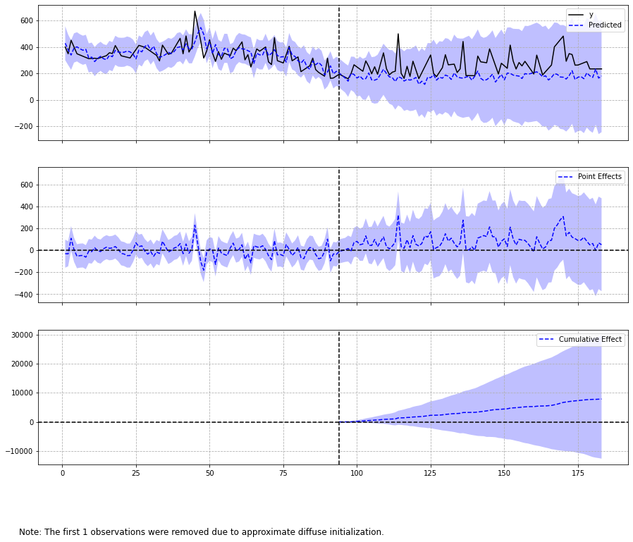
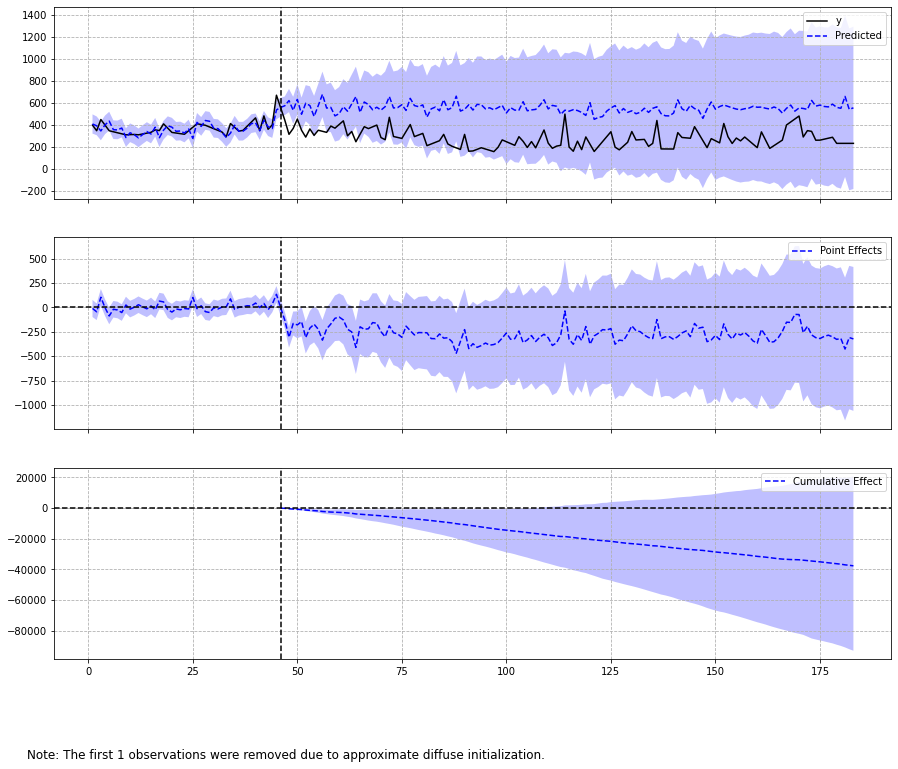

ref: https://www.markdownguide.org/basic-syntax/

note: reorder the locations, from blast site (1) to Airport (6) - ports first, residential second.

  
<h1> Night-Time Light Investigation into the Beirut Explosion (2020-08-04) </h1>
 
Gijs van den Dool [1](#f1)
@ Space-ins.-Solutions [2](#f1)
 

 
<h2> Introduction </h2>

 

<h2> Area of Interest </h2>

 

  
Figure 1: Area of Intrest (Lebanon/Beirut) 
 

<h3> Local View </h3>

Six locations are selected to test the change in NTL before and afer the explosion. The location position is randon, but the location type is prediterment. To compare the Blast Area (as a port location), two other port locations are selected, and the main intest of the study is to see if it is possible to detect recovery rates, so two residential areas are added to the selection, and finally the Airport is included in the test locations because of the presumed stability in NTL intensity.

 

  
Figure 2: Six pilot locations (Greater Beirut Area) 
 

<h2>Data</h2>

 

<h2>Exploratory Data Analysis (EDA)</h2>

 

<h3> EDA 1 </h3>

 

  
Figure 3: XXXX 
 

<h3> EDA 2 </h3>

 

  
Figure 4: XXXX 
 

<h3> EDA 3 </h3>

 

  
Figure 5: XXXX 
 

<h3> EDA 4 </h3>

 

  
Figure 6: XXXX 
 

<h3> EDA 5 </h3>

 

  
Figure 7: XXXX 
 

<h2>Statistics</h2>

 

<h3> Method 1: T-Test </h3>

 

<h3> Method 2: Causual Impact  </h3>

 

Table 1: Causal Imapact Results; method adapted from CausalImpact [5](#f1)   
<table>
    <tr>
        <td>Event date: 2020-08-04</td>
        <td>Event date: 2020-06-20</td>
    </tr>
    <tr>
        <td valign="top"></td>
        <td valign="top"></td>
    </tr>
    <tr>
        <td valign="top"> The probability of obtaining this effect by chance is p = 21.78%.   
        This means that, although the intervention appears to have caused a <strong>positive</strong> effect, the effect may be spurious and would generally not be considered statistically significant, when considering the entire post-intervention period as a whole. 
        </td> 
        <td valign="top"> The probability of obtaining this effect by chance is p = 9.59%.    
        Although it may look as though the intervention has exerted a <strong>negative</strong> effect on the response variable when considering the intervention period as a whole, this effect may be spurious and would generally not be considered statistically significant.
        </td>
    </tr>
    <tr>
        <td> Method adapted from CausalImpact [5](#f1)                          
        </td>
    </tr>
</table>
 
 

<h2>Conclusion</h2>

 

---
 

<b id="f1">1</b> https://www.linkedin.com/in/gvddool/ [↩](#a1) 
<b id="f1">2</b> https://www.spaceinssolutions.com/ [↩](#a2) 

<h2>References</h2>

Example 3 [3](#f1) 
Example 4 [4](#f1) 

<b id="f1">3</b> https://www.linkedin.com/in/gvddool/ [↩](#a3) 
<b id="f1">4</b> https://www.spaceinssolutions.com/ [↩](#a4) 

<b id="f1">5</b> CausalImpact GitHub repro https://github.com/dafiti/ [↩](#a5) 

